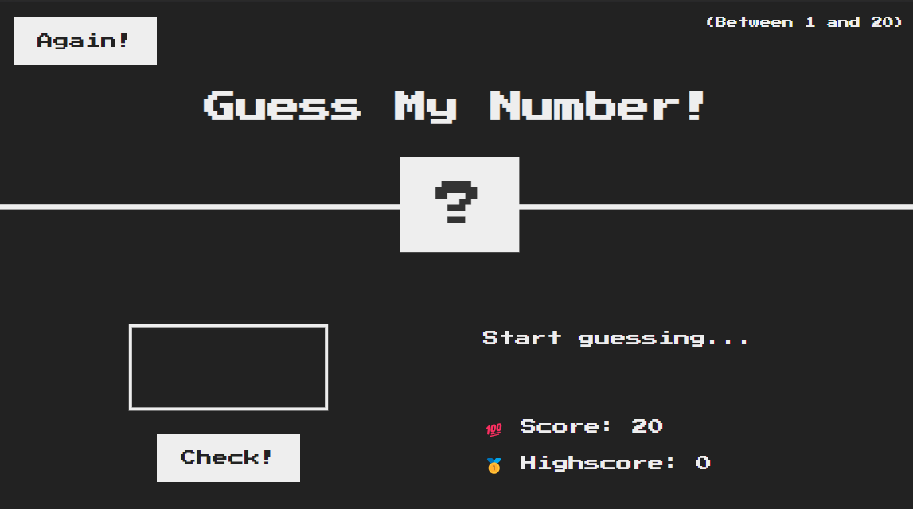
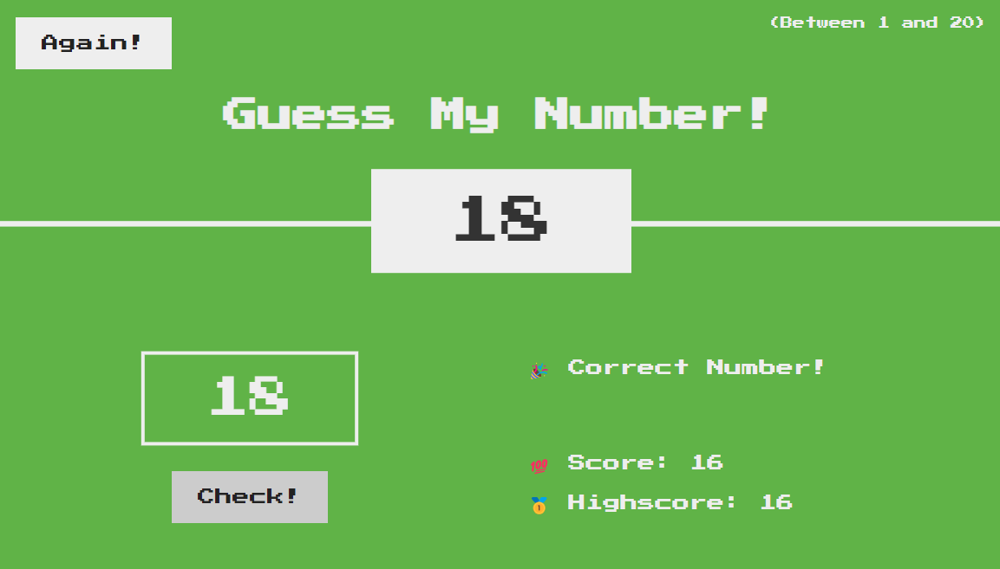
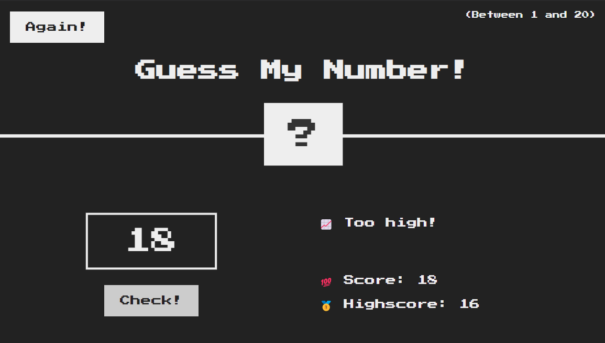

# Guess My Number Game

## Description

A retro game of guessing built just for fun.

Working on this little project was a great experience for me to practice my JavaScript skills including DOM manipulation, if statements, functions and event listeners, as well as some code refactoring to make sure that my code is DRY.

## Installation

N/A

## Usage

This game is best played on the desktop or on a tablet. While it is mostly responsive, some of the functionality hasn't yet been tested on mobile.

On the initial sreen, the user is prompted to input a number between 1 and 20 into the checkbox. If the input is empty, or if it's higher than 20, an error will show instead of 'Start guessing'.

The user has a score of 20 when the game starts, with each incorrect guess taking away one point.

If the guess is between 1 and 20, but not correct, the message will let the user know whether their guess was higher or lower than the secret number, and a point wil be taken away.

The game ends once 0 is reached, and a message will prompt the user to begin again.

If the user guesses the correct number before reaching 0 points, the secret number will be revealed and the background will change to green, together with a confirmation message.

Once the round ends (Either by losing or winning), the user can re-start the game by clicking 'Again'. For the next rounds, the previous highscore will be recorded and shown during each new round.

## Credits

This project was created with the instruction and support of Udemy Instructor Jonas Schmedtmann, as part of his The Complete JavaScript Course 2024: From Zero to Expert:
https://www.udemy.com/course/the-complete-javascript-course

This course was essential in building my JavaScript skills and practicing through engaging and fun projects.

Please note: the design of this project was provided through this course, and my work was to implement the JavaScript code to make the game functional.

Badges at the bottom of this README file were listed with the help of the following repository: https://github.com/Ileriayo/markdown-badges

## License

MIT License

Copyright (c) 2023 Alexandra Asanache

Permission is hereby granted, free of charge, to any person obtaining a copy
of this software and associated documentation files (the "Software"), to deal
in the Software without restriction, including without limitation the rights
to use, copy, modify, merge, publish, distribute, sublicense, and/or sell
copies of the Software, and to permit persons to whom the Software is
furnished to do so, subject to the following conditions:

The above copyright notice and this permission notice shall be included in all
copies or substantial portions of the Software.

THE SOFTWARE IS PROVIDED "AS IS", WITHOUT WARRANTY OF ANY KIND, EXPRESS OR
IMPLIED, INCLUDING BUT NOT LIMITED TO THE WARRANTIES OF MERCHANTABILITY,
FITNESS FOR A PARTICULAR PURPOSE AND NONINFRINGEMENT. IN NO EVENT SHALL THE
AUTHORS OR COPYRIGHT HOLDERS BE LIABLE FOR ANY CLAIM, DAMAGES OR OTHER
LIABILITY, WHETHER IN AN ACTION OF CONTRACT, TORT OR OTHERWISE, ARISING FROM,
OUT OF OR IN CONNECTION WITH THE SOFTWARE OR THE USE OR OTHER DEALINGS IN THE
SOFTWARE.

## Badges

 
